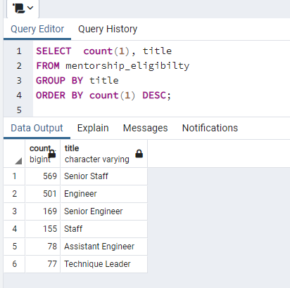

# Pewlett-Hackard-Analysis

## Overview of the analysis:
In order to help Bobby’s manager to prepare for the “silver tsunami” as many current employees reach retirement age, you will perform the following tasks:
1. determine the number of retiring employees per title
2. identify employees who are eligible to participate in a mentorship program
3. write a report that summarizes your analysis and helps prepare Bobby’s manager for the “silver tsunami”

## Results:
- From the [retirement_titles.csv](Data/retirement_titles.csv) generated from [Employee_Database_challenge.sql](Queries/Employee_Database_challenge.sql), there are **133776** records that holds all the titles of employees who were born between 1952 and 1955. There are some duplicate entries for some employees (e.g. 3 records found for "emp_no" 10009) because they have switched titles over the years.

- By retrieving `DISTINCT` employees records based on `employers.emp_no`, there are **90,398** unique employees ([unique_titles.csv](Data/unique_titles.csv)) who were born between 1952 and 1955, and rearched the retirment age.
- By comparing with the total number of employees (i.e. number of rows in "employees" table =  300024), it means about 30.13% of the employees are in retirement age!

- Based on the [retiring_titles.csv](Data/retiring_titles.csv), the top 3 retiring titles are:
    1. Senior Engineer, 29414 counts
    2. Senior Staff, 28255 counts
    3. Engineer, 14222 counts
- Based on the [mentorship_eligibilty.csv](Data/mentorship_eligibilty.csv) generated from [Employee_Database_challenge.sql](Queries/Employee_Database_challenge.sql), there are **1,549** current employees who were born in 1965 and eligibile for the Mentorship Program.

## Summary:
Provide high-level responses to the following questions, then provide two additional queries or tables that may provide more insight into the upcoming "silver tsunami."

- How many roles will need to be filled as the "silver tsunami" begins to make an impact?
    - Since there are **90,398** unique employees ([unique_titles.csv](Data/unique_titles.csv)) who were born between 1952 and 1955, and rearched the retirment age, these positions will need to be filled, and it is covered in 6 types of titles as follows.


- Are there enough qualified, retirement-ready employees in the departments to mentor the next generation of Pewlett Hackard employees?
    - There are only **1,549** current employees who are eligibile for the Mentorship Program.  This manpower may not be enough to mentor the next generation of Pewlett Hackard employees which is over 90,000.

- Additional queries or tables that may provide more insight into the upcoming "silver tsunami":
    1) Run the following SQL to retrieve the number of qualified mentor for each title.  IT shows that there are 169 mentors with the title of Senior Engineer to coach 29414 new posts of Senior Engineer.
    ```
    SELECT  count(1), title
    FROM mentorship_eligibilty
    GROUP BY title
    ORDER BY count(1) DESC;
    ```
    

    2) Run 
    
